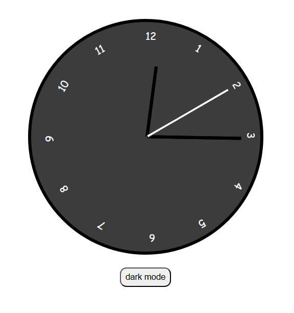
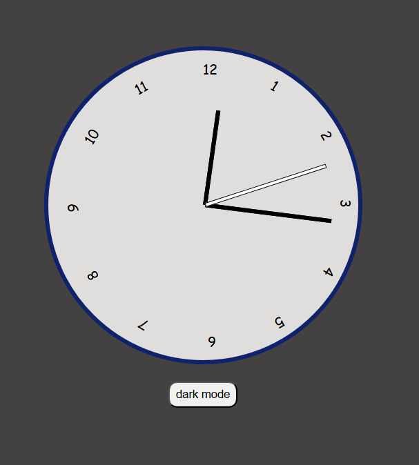

# 🕒 Analog Clock with Dark Mode

A beautiful and functional **Analog Clock** built using **HTML, CSS, and JavaScript**, featuring a smooth real-time display and a toggle for **Dark Mode**. This project demonstrates DOM manipulation, CSS transforms, and theme switching — all without any libraries or frameworks.

 

## ✨ Features

- 🕰️ Real-time analog clock
- 🎯 Smooth rotation of hour, minute, and second hands
- 🌗 Toggle between Light and Dark Mode
- 📱 Responsive design — works on all screen sizes
- 💡 Built with pure HTML, CSS, and JavaScript (no frameworks)

## 🚀 Technologies Used

- **HTML5** – to structure the clock face and controls  
- **CSS3** – for styling, transitions, and dark mode themes  
- **JavaScript** – to dynamically update the time and handle theme toggle

## 📂 Project Structure

analog-clock/
├── index.html # Main HTML file
├── style.css # Styles for light and dark themes
├── script.js # Clock logic and theme toggle
└── Screenshots # Image used in the README